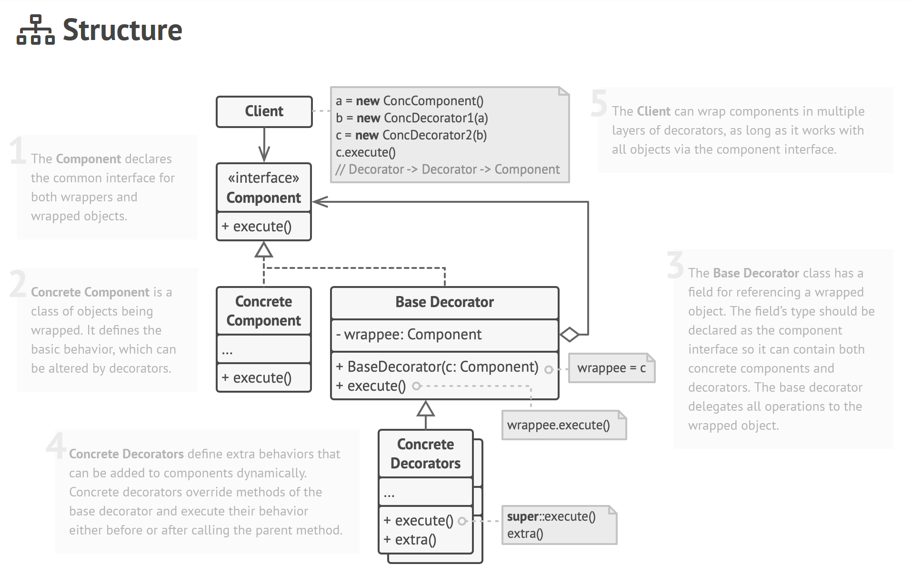
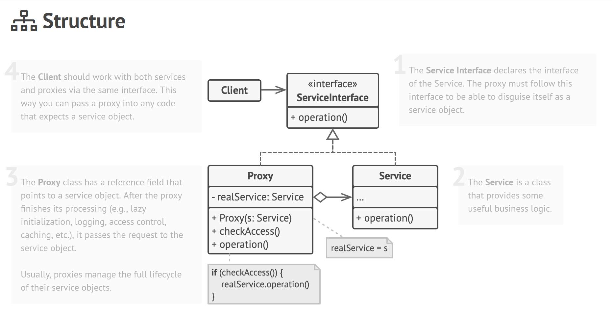

# Decorator And Proxy Patterns

## What is the difference between the two? 

**Decorator**:
<ul>
  <li>Uses composition.</li>
  <li>Can enhance object through interfaces.</li>
  <li>Single responsibility principle.</li>
  <li>Can combine multiple wrappers to combine behaviors.</li>
  <li>Is always controlled by the client.</li>
</ul>
Use Cases:
A product that the essence stays the same but can be added multiple things, adding features at runtime, need flexibility.

---

**Proxy**
<ul>
  <li>Uses composition.</li>
  <li>Same interface as its object.</li>
  <li>Open/Closed Principle.</li>
  <li>It works even if the object is not available.</li>
  <li>Manages the life cycle of its object on its own without clients knowing.</li>
</ul>
Use Cases:
Lazy initialization, access control, logging requests.

---
Decorator Structure

  

Proxy Structure

  

